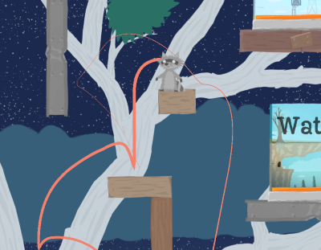
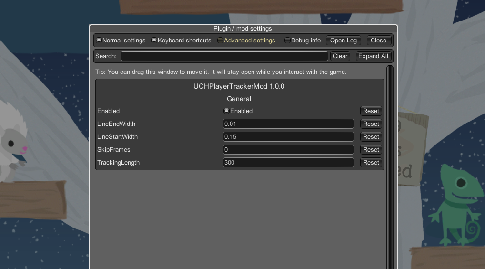

# UCH-PlayerTracker-Mod
This mod draws a line behind the character in its color.



## Installation
BepInEx v5 needs to be installed and the mod must be placed in the **%UCHRoot%\BepInEx\plugins** folder.

## Configuration
Install [BepInEx-ConfigurationManager](https://github.com/BepInEx/BepInEx.ConfigurationManager) to change settings in game.



To disable the mod change the file **%UCHRoot%\BepInEx\config\UCHPlayerTrackerMod.cfg** and set 

```
AutoSave Enabled = false
```

## Credits
- [Clever Endeavour Games](https://www.cleverendeavourgames.com/)
- [BepInEx](https://github.com/BepInEx/BepInEx)